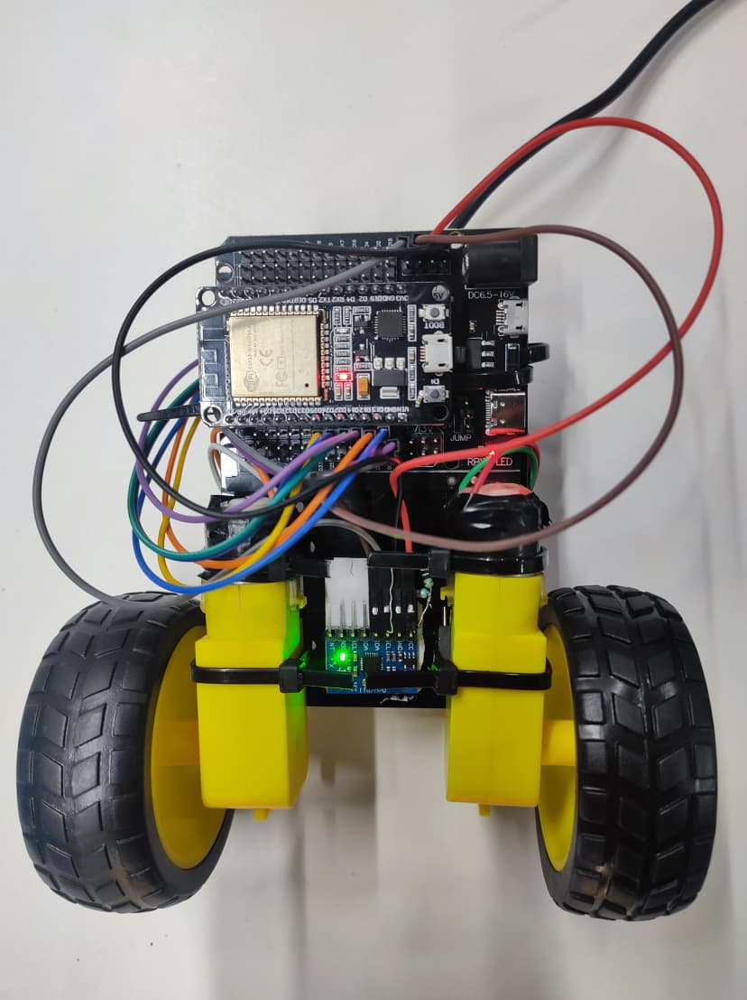
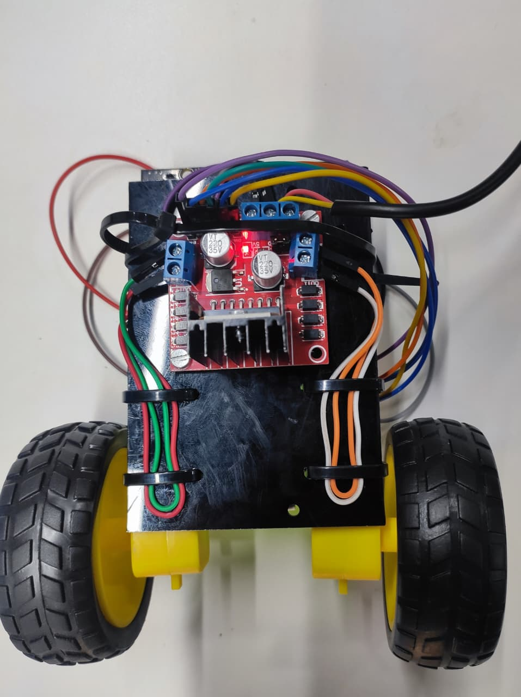

# Self-Balancing IoT Robot
A high-performance, two-wheeled inverted pendulum robot designed for real-time stability and wireless calibration.

## 🚀 Overview
This project implements a closed-loop **PID control system** to maintain upright balance. By fusing accelerometer and gyroscope data through a **Kalman Filter**, the robot achieves precise tilt-angle estimation and smooth motor response.

---

### 🎥 Demonstration

  
  

---

## 🛠️ Tech Stack
* **Microcontroller:** ESP32
* **Sensors:** MPU6050 6-Axis IMU
* **Actuators:** BO Motors + L298N Motor Driver
* **Connectivity:** Blynk IoT (Wi-Fi)
* **Firmware:** Embedded C++

---

## 🧠 Key Features
* **Real-Time PID Tuning:** Adjust $K_p$, $K_i$, and $K_d$ values on the fly via the **Blynk mobile app** without reflashing code.
* **Sensor Fusion:** Implemented a **Kalman Filter** to eliminate high-frequency noise and gyro drift, ensuring reliable tilt sensing.
* **PWM Control:** Fine-tuned pulse-width modulation to manage motor torque and responsive counter-balancing.

---

## ⚙️ How to Run
1. **Hardware:** Connect the MPU6050 and L298N to the ESP32 as per the schematics.
2. **Blynk Setup:** Create a new project in the Blynk app and obtain your Auth Token.
3. **Flash Firmware:** Open the code in your IDE, enter your Wi-Fi credentials, and upload.
